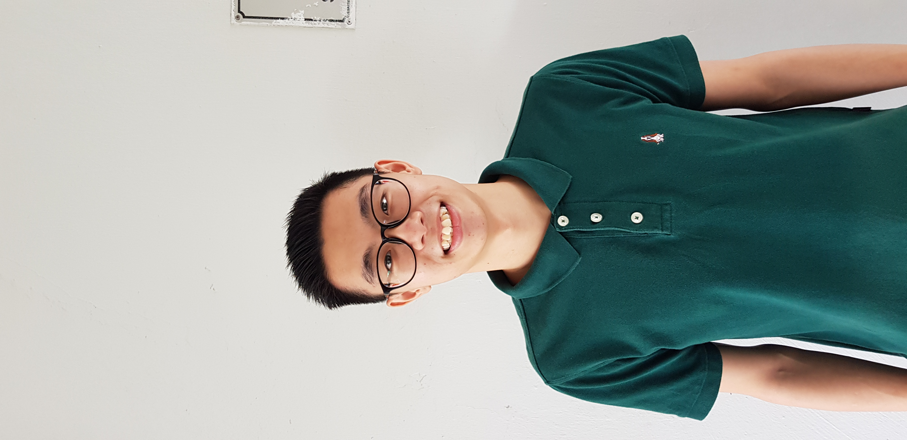
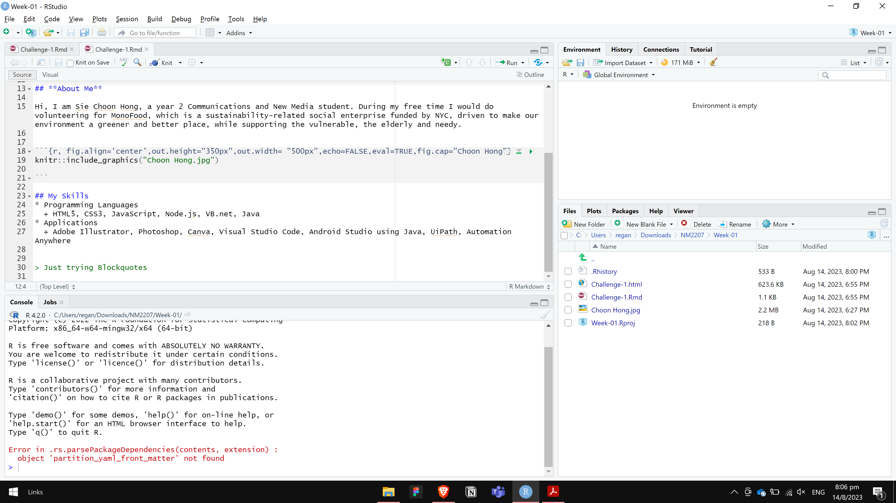

```{r setup, include=FALSE}
knitr::opts_chunk$set(echo = TRUE)
```
## **About Me**

Hi, I am Sie Choon Hong, a year 2 Communications and New Media student. During my free time I would do volunteering for MonoFood, which is a sustainability-related social enterprise funded by NYC, driven to make our environment a greener and better place, while supporting the vulnerable, the elderly and needy. 


```{r, fig.align='center',out.height="350px",out.width= "500px",echo=FALSE,eval=TRUE,fig.cap="Choon Hong"}


```

## My Skills
* Programming Languages
  + HTML5, CSS3, JavaScript, Node.js, VB.net, Java
* Applications
  + Adobe Illustrator, Photoshop, Canva, Visual Studio Code, Android Studio using Java, UiPath, Automation Anywhere
  

> Just trying Blockquotes

## RStudio Layout
```{r, fig.align='center',out.height="350px",out.width= "500px",echo=FALSE,eval=TRUE,fig.cap="RStudio Layout "}


```
