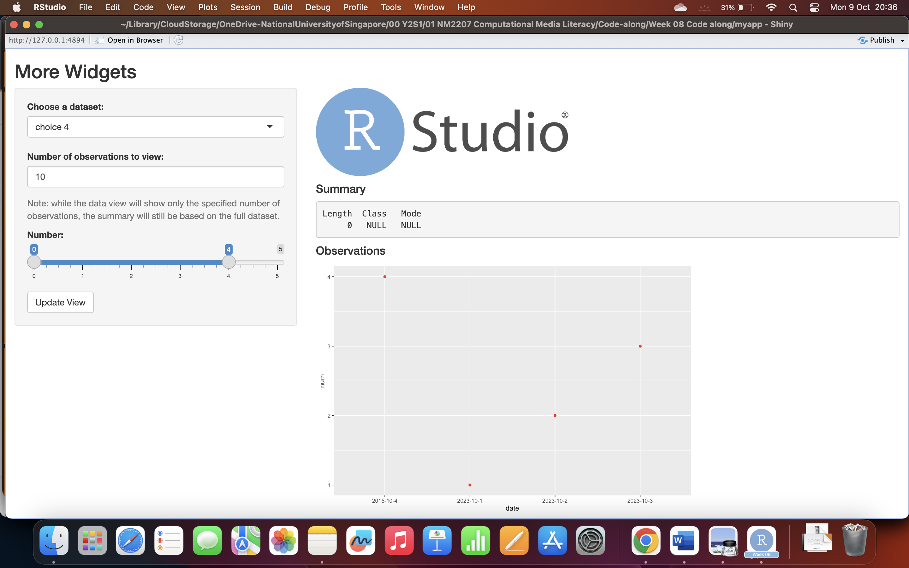

```{r setup, include=FALSE}
knitr::opts_chunk$set(echo = TRUE)
```

# RunExample("01_Hello")


# Combination of the Code along


# Challenge-8

I have create 3 variables called num, let and date, which will be in a dataframe. I have also created an input slider. Under server section, I will call the variable of dataframe to generate a ggplot and placed under the main panel

Challenge-8
